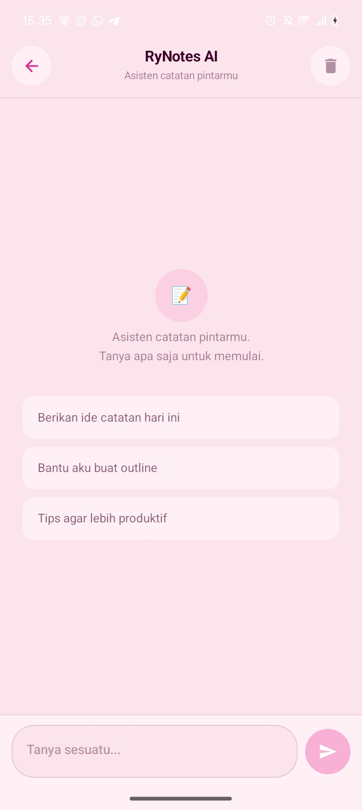
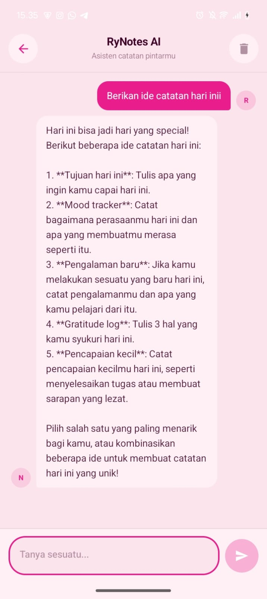

# RyNotes - Pengembangan Aplikasi Mobile

**Nama:** Memory Simanjuntak  
**NIM:** 123140095  
**Mata Kuliah:** Pengembangan Aplikasi Mobile — ITERA 2025/2026

---

## Deskripsi Aplikasi

RyNotes adalah aplikasi manajemen catatan berbasis Kotlin Multiplatform (KMP) yang mendukung platform Android, iOS, dan Desktop. Aplikasi ini dilengkapi fitur AI Chat Assistant untuk membantu pengguna dalam pengelolaan catatan secara cerdas.

---

## Fitur Utama

- Manajemen catatan dengan kategori (Personal, Work, Study, dll)
- Todo/checklist items di dalam catatan
- Filter dan pencarian catatan secara real-time
- Dark mode & pengaturan tampilan
- AI Chat Assistant (Groq API)
- Monitoring konektivitas jaringan

---

## AI Chat Assistant

Aplikasi ini dilengkapi fitur AI Chat yang memungkinkan pengguna berinteraksi dengan asisten AI untuk membantu pengelolaan catatan.

**Fitur yang tersedia:**
- Chat multi-turn dengan konteks percakapan yang terjaga
- Mendapatkan ide dan inspirasi untuk catatan
- Membuat template catatan
- Tips produktivitas

**Teknologi yang digunakan:**
- Groq API dengan model llama-3.3-70b-versatile
- Ktor Client untuk HTTP request
- Clean Architecture (Service → Repository → ViewModel → UI)

**Cara menggunakan:**
1. Buka aplikasi RyNotes
2. Tap ikon Bintang di pojok kanan atas HomeScreen atau ikon yang berada di sebelah ikon setting
3. Ketik pertanyaan atau permintaan
4. AI akan membalas dalam Bahasa Indonesia

---

## Screenshots

### Home Screen


### Chat Screen


### Chat Interaktif


---

## Tugas Praktikum Minggu 10 — Testing & Dependency Injection

### Dependency Injection (Koin)

Implementasi Koin DI dengan 2 modules terpisah:

**`dataModule`** — mengelola data layer:
- `NoteRepository` (singleton)
- `SettingsRepository` (singleton)
- `GeminiService` (singleton)
- `AIRepository` (singleton)

**`viewModelModule`** — mengelola presentation layer:
- `NotesViewModel`
- `SettingsViewModel`
- `ChatViewModel`

---

### Daftar Test Cases

#### NoteRepositoryTest (8 test cases)
| No | Test Case | Status |
|----|-----------|--------|
| 1 | `getNoteById_existingId_returnsCorrectNote` | ✅ PASSED |
| 2 | `getNoteById_nonExistingId_returnsNull` | ✅ PASSED |
| 3 | `insertNote_validNote_addsToBeginningOfListWithNewId` | ✅ PASSED |
| 4 | `deleteNote_existingNote_removesFromList` | ✅ PASSED |
| 5 | `deleteNoteById_existingId_removesFromList` | ✅ PASSED |
| 6 | `updateNote_existingNote_modifiesDetails` | ✅ PASSED |
| 7 | `getAllNotes_flowEmitsUpdatedList_whenNewNoteInserted` *(Turbine)* | ✅ PASSED |
| 8 | `getAllNotes_flowEmitsUpdatedChecklistState_whenTodoItemToggled` *(Turbine)* | ✅ PASSED |

#### SettingsRepositoryTest (2 test cases)
| No | Test Case | Status |
|----|-----------|--------|
| 1 | `testDefaultSettings` | ✅ PASSED |
| 2 | `testUpdateSettings` | ✅ PASSED |

#### NotesViewModelTest (8 test cases — MockK)
| No | Test Case | Status |
|----|-----------|--------|
| 1 | `init_observesNetworkAndLoadsNotes` | ✅ PASSED |
| 2 | `updateSearchQuery_filtersNotesCorrectly` | ✅ PASSED |
| 3 | `updateSearchQuery_emptyQuery_returnsAllNotes` | ✅ PASSED |
| 4 | `selectCategory_filtersNotesCorrectly` | ✅ PASSED |
| 5 | `selectCategory_allCategory_returnsAllNotes` | ✅ PASSED |
| 6 | `searchAndCategory_combined_filtersCorrectly` | ✅ PASSED |
| 7 | `addNote_callsRepositoryInsert` | ✅ PASSED |
| 8 | `networkDisconnected_updatesIsConnectedState` | ✅ PASSED |

#### HomeScreenTest (3 test cases — Compose UI Test)
| No | Test Case | Status |
|----|-----------|--------|
| 1 | `searchField_isDisplayed_andAllowsInput` | ✅ PASSED |
| 2 | `categoryChips_areDisplayed_andCanBeSelected` | ✅ PASSED |
| 3 | `emptyNotesView_isDisplayed_whenNotesListIsEmpty` | ✅ PASSED |

---

### Ringkasan Test

| Kategori | Jumlah Test | Status |
|----------|-------------|--------|
| Repository Tests | 8 | ✅ All Passed |
| ViewModel Tests (MockK) | 8 | ✅ All Passed |
| Flow Tests (Turbine) | 2 | ✅ All Passed |
| UI Tests (Compose) | 3 | ✅ All Passed |
| **Total** | **21** | **✅ 21/21 Passed** |

---

### Coverage Report


| Package | Class % | Method % | Line % |
|---------|---------|---------|--------|
| `data.model` | 100% | 100% | 100% |
| `data.repository` | 66.7% | 76.5% | **88.2%** |
| `presentation` | 47.9% | 43.8% | **54.4%** |
| `ui.components` | 100% | 33.3% | 18.7% |

> Coverage business logic (`data.repository` + `presentation`) rata-rata **~71% line coverage**.

---

### Cara Menjalankan Test

```bash
# Jalankan semua unit test
./gradlew :composeApp:jvmTest

# Generate coverage report HTML
./gradlew :composeApp:koverHtmlReport
# Buka: composeApp/build/reports/kover/html/index.html
```

---

## Tech Stack

| Layer | Teknologi |
|-------|-----------|
| Language | Kotlin Multiplatform |
| UI | Compose Multiplatform |
| DI | Koin 4.0 |
| Networking | Ktor Client |
| State Management | StateFlow + MVVM |
| Testing | kotlin.test, MockK, Turbine, Compose UI Test |
| Coverage | Kover |
| AI | Groq API (llama-3.3-70b), Gemini API |
